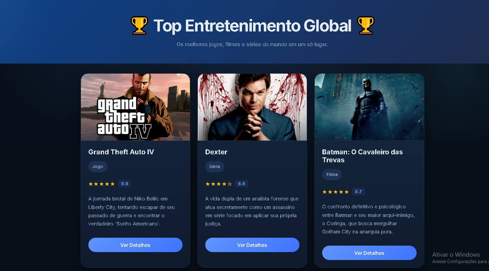
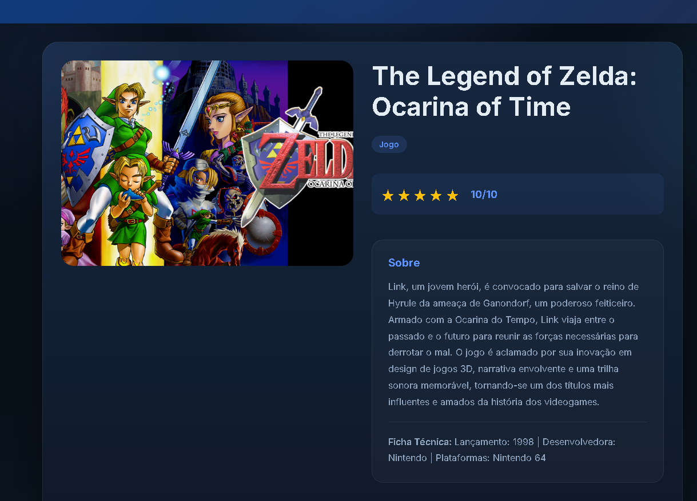

# Trabalho Prático - Semana 11

Nesta atividade, vamos dar continuidade ao projeto desenvolvido ao longo deste semestre, acrescentando a página de detalhes da aplicação.

Imagine que a página principal (home-page) mostre uma visão dos vários itens que existem no seu site. Ao clicar em um item, você é direcionado para a página de detalhes. A página de detalhes vai mostrar todas as informações sobre o item do seu projeto, seja esse item uma notícia, filme, receita, lugar turístico ou evento.

## Informações Gerais

- Nome: Diogo Vieira Teodoro Ferreira
- Matrícula: 1645894
- Descreva brevemente seu projeto: Catálogo dinâmico de jogos, filmes e séries. A página principal consome uma estrutura de dados em JSON para renderizar os cards de forma automática, enquanto uma única página de detalhes utiliza parâmetros na URL (query string) para identificar o ID do item clicado e carregar suas informações completas na tela, eliminando totalmente a necessidade de duplicar arquivos HTML e mantendo a arquitetura do código limpa e eficiente.

## Prints do trabalho

<<  HOME-PAGE  >>



<<  TELA DE DETALHES  >>




## Dados em JSON
Inclua abaixo a estrutura de dados definida para o seu projeto, apresentando pelo menos dois exemplos de registros em formato JSON.

```json
{
  "itens": [
    {
      "id": 1,
      "titulo": "Grand Theft Auto IV",
      "categoria": "Jogo", 
      "pequenadescrição": "Pequena descrição sobre o tema",
      "descrição": "Uma descrição maior explicando o tema",
      "nota": "10",
      "extra": "Mostrando os detalhes",
    },
    {
      "id": 2,
      "titulo": "Dexter",
      "categoria": "Série", 
      "pequenadescrição": "Pequena descrição sobre o tema",
      "descrição": "Uma descrição maior explicando o tema",
      "nota": "10",
      "extra": "Mostrando os detalhes",
    },
    {
      "id": 3,
      "titulo": "Batman: O Cavaleiro das Trevas",
      "categoria": "Filme", 
      "pequenadescrição": "Pequena descrição sobre o tema",
      "descrição": "Uma descrição maior explicando o tema",
      "nota": "10",
      "extra": "Mostrando os detalhes",
    }
  ]
}
```


